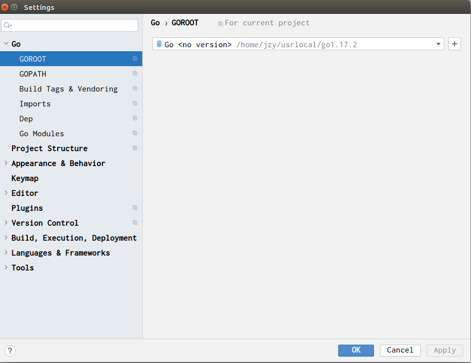
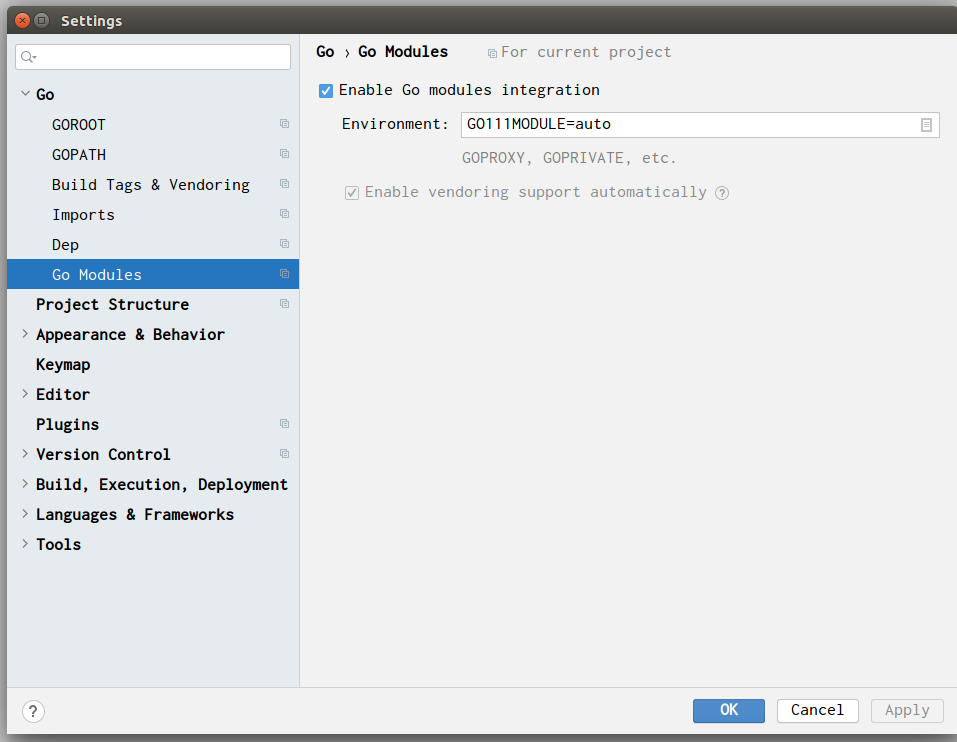

## `Go`简介

`Go`语言最初由` Robert Griesemer, Rob Pike, and Ken Thompson`[^1]于2007年在Google开始设计和实现。`Go`语言类似于`C`语言，是一门静态类型语言。`Go`提供的特性包括：垃圾收集器[^2]、类型安全、动态语言的`动态类型(Dynamic-typing capability)`，还有一些内置的类型，比如`变长数组类型(Variable Length Arrays)和map类型`。`Go`也提供一个功能丰富的标准库，方便程序员使用。在2009年11月份，`Go`语言被正式发布。目前，`Go`语言也被用在Google的一些生产系统中。


### 适用对象 

这份指南将帮助您从零开始学习`Go`编程语言，帮助您理解必要的Go语言知识，为您进一步提升`Go`语言的技能，打下坚实的基础。

### 必要条件

为了读懂这份指南，您需要具备基本的编程技能。如果您有很好的`C`语言基础，这将有利于加快您学习`Go`语言进程。


## `Goland`安装

目前golang的集成开发环境，用的比较广泛的，主要有两种：vscode+插件、Jetbrains的Goland，由于之前使用过Jetbrains的phpstorm, webstorm, ideal，故而这里记录Jetbrains的Goland的安装方式

### 下载

下载的方式有两种：一种是直接使用Jetbrains官网的下载链接进行下载，。注意：Jetbrains的官网网址属于墙外的网址，无法直接访问与下载，目前下载链接好像可以下载。

>https://download.jetbrains.com.cn/go/goland-2018.2.exe
>https://download.jetbrains.com.cn/go/goland-2019.1.exe
>https://download.jetbrains.com.cn/go/goland-2019.2.exe
>https://download.jetbrains.com.cn/go/goland-2019.3.1.exe
>https://download.jetbrains.com.cn/go/goland-2020.3.1.tar.gz
>https://download.jetbrains.com.cn/go/goland-2020.3.1.dmg
>https://download.jetbrains.com.cn/go/goland-2020.3.1.exe

也可以使用国内镜像网址进行下载，目前国内镜像网址支持下载以下版本：

>[goland-2018.2.exe](https://download.jetbrains.8686c.com/go/goland-2018.2.exe)
>[goland-2019.1.exe](https://download.jetbrains.8686c.com/go/goland-2019.1.exe)
>[goland-2019.2.exe](https://download.jetbrains.8686c.com/go/goland-2019.2.exe)
>[goland-2019.3.1.exe](https://download.jetbrains.8686c.com/go/goland-2019.3.1.exe)
>[goland-2020.3.1.tar.gz](https://download.jetbrains.8686c.com/go/goland-2020.3.1.tar.gz)
>[goland-2020.3.1.dmg](https://download.jetbrains.8686c.com/go/goland-2020.3.1.dmg)
>[goland-2020.3.1.exe](https://download.jetbrains.8686c.com/go/goland-2020.3.1.exe)

### 使用

- 关于Jetbrains的Licence

如果大家有钱，建议花钱购买Licence；如果大家没多少钱，可以参考使用ide-eval-resetter这个插件。一直找Licence Code，大家也都受不了！

使用此插件的时候，建议2020后的版本

插件的安装，直接把插件拖到打开的IDE中即可启动安装程序

- 开发使用

    在正在开始运行Hello World之前，需要设置三个参数：`GOROOT`、`GOPATH`、`Go Modules`

    1. `GOROOT`主要是设置`Go`编译器，如下图所示：此处自动进行下载，只要选择一下即可，这里选择的是`go1.17.2`
    
        

    2. `GOPATH`和`Go Modules`都是关于Go的包管理相关的环境变量，`GOPATH`可以在包管理的时候说，不过`Go Modules`必须此时设置，否则调试和运行，会出现下面的错误：

        ```bash
        go: cannot find main module, xxxx
            to create a module there, run:
            cd .. && go mod init
        ```

        做一下如下配置即可：

        


## 英文原文

Go language is a programming language initially developed at Google in the year 2007 by Robert Griesemer, Rob Pike, and Ken Thompson. It is a statically-typed language having syntax similar to that of C. It provides garbage collection, type safety, dynamic-typing capability, many advanced built-in types such as variable length arrays and key-value maps. It also provides a rich standard library. The Go programming language was launched in November 2009 and is used in some of the Google's production systems.

### Audience

This tutorial is designed for software programmers with a need to understand the Go programming language from scratch. This tutorial will give you enough understanding on Go programming language from where you can take yourself to higher levels of expertise.

### Prerequisites

Before proceeding with this tutorial, you should have a basic understanding of computer programming terminologies. If you have a good command over C, then it would be quite easy for you to understand the concepts of Go programming and move fast on the learning track.

[^1]: `Ken Thompson`是《C程序设计语言》的作者之一，发明了`B`语言和`UNIX`操作系统；`Rob Pike`是《程序设计实践》作者之一；`Robert Griesemer`设计了`V8`引擎和`Hotspot`虚拟机
[^2]: 自动内存管理